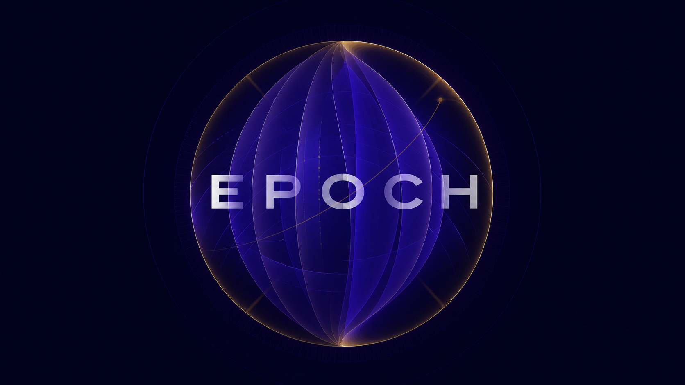

# Epoch

「Epoch」是我给自己搭建的个人投资控制台，管理我本人的 IBKR 卫星仓。该系统提供以下功能：

- **投资记录**：长期记录组合表现，投资逻辑，与基准进行对比；
- **仓位解读**：穿透性分析持仓是否合理有效；
- **信息跟踪**：将新闻和一手证据转化为可解释的风险信号；
- **风险管理**：基于风险信号对组合风险敞口进行管控；
- **辅助投研**：对外暴露 Skills & APIs，便于借助代理式 AI 进行投研分析；

## 项目文档

- [产品设计](docs/DESIGN.md)：产品定位、范围、用户体验和验收场景
- [技术架构](docs/ARCHITECTURE.md)：系统结构、数据模型、技术选型和安全边界
- [投资框架](docs/STRATEGY.md)：投资原则、证据政策、风险和仓位规则
- [实施路线](docs/ROADMAP.md)：开发阶段、依赖关系和阶段验收标准
- [视觉规范](docs/THEME.md)：网页配色方案与主题规范
- [视觉资产](assets/)：项目使用的图片、图标与主题资源
