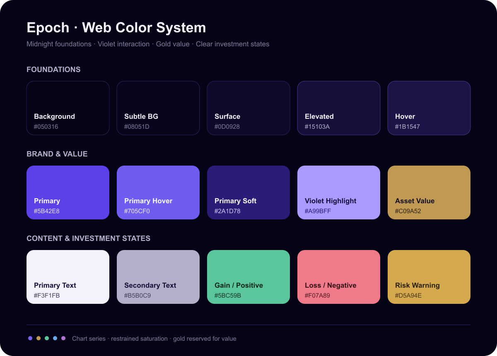

# Epoch 网页配色方案

Epoch 采用“午夜蓝背景、深紫玻璃、克制金色价值线”的深色主题。紫色用于品牌和交互主状态，金色用于资产价值、关键指标与少量强调，避免大面积金色造成视觉噪音。

## 核心色

| 用途 | 色值 | 建议使用位置 |
| --- | --- | --- |
| 页面背景 | `#050316` | 全局背景、导航外层 |
| 次级背景 | `#08051D` | 页面分区、侧栏 |
| 卡片表面 | `#0D0928` | 卡片、表格、输入框 |
| 悬浮表面 | `#15103A` | 弹层、下拉菜单、悬浮卡片 |
| 品牌主色 | `#5B42E8` | 主按钮、选中态、关键图形 |
| 紫色高光 | `#A99BFF` | 聚焦环、轻量高亮 |
| 价值金 | `#C09A52` | 资产价值、基准线、少量强调 |
| 主文字 | `#F3F1FB` | 标题、正文关键内容 |
| 次级文字 | `#B5B0C9` | 描述、表头、辅助信息 |
| 弱化文字 | `#7F7999` | 时间戳、占位符、注释 |
| 默认边框 | `#2B2460` | 卡片、表格、分隔线 |

## 投资状态色

| 状态 | 色值 | 用途 |
| --- | --- | --- |
| 收益 / 正向 | `#5BC59B` | 正收益、风险改善、成功状态 |
| 回撤 / 负向 | `#F07A89` | 亏损、风险上升、错误状态 |
| 警示 | `#D5A94E` | 风险预警、阈值接近 |
| 信息 | `#6DA8E8` | 中性提示、基准与参考数据 |

状态不能只依赖颜色表达，应同时提供箭头、正负号、标签或图标。

## 图表序列

推荐顺序：

1. `#7662EE`
2. `#C09A52`
3. `#5BC59B`
4. `#6DA8E8`
5. `#B472D1`

网格线使用 `rgba(169, 155, 255, 0.12)`。主组合使用紫色，基准使用金色，避免同时使用多个高饱和色。

## 使用原则

- 背景与卡片通过明度差区分，不依赖厚重阴影。
- 金色只占页面视觉面积的约 5%，主要服务于价值和轨迹表达。
- 紫色主按钮搭配浅色文字；危险操作使用负向色，不使用品牌紫。
- 正文和数据优先保证对比度，装饰性玻璃效果不得影响可读性。
- 完整 CSS 变量见 [`assets/theme.css`](../assets/theme.css)。
